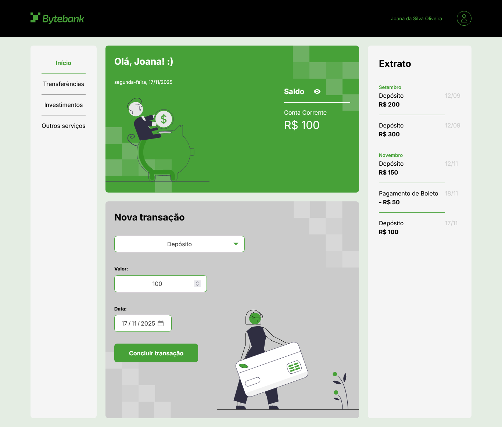

# bytebank

ByteBank is a simulated online banking platform built with HTML, CSS, and TypeScript.
The application allows users to perform virtual banking operations such as deposits, bill payments, and transfers.
Users can choose the operation type, the amount, and the date of execution. If the selected date is in the future, the operation is scheduled and will only be processed on that specific day.

Since the project has no backend or database, all data is stored in the browser’s localStorage. Scheduled operations are executed only while the user is actively on the website, and immediate operations occur instantly.
The platform also includes a transactions statement that automatically refreshes every 5 minutes, displaying all processed actions.

---

## ✨ Features

- Deposit Simulation: Add funds to the virtual account by choosing the amount and the desired execution date.

- Bill Payment Simulation: Register bill payments by entering the amount and date. Future-dated payments are scheduled automatically.

- Transfer Simulation: Perform mock transfers by selecting the amount and defining a current or future execution date.

- Future Operations Scheduling: Any operation set for a future date is stored in localStorage and only executed when the date matches and the user is on the website.

- LocalStorage Data Management: All operations (past, immediate, and scheduled) are persisted locally with no backend dependency.

- Automatic Statement Update: The transaction statement is refreshed every 5 minutes, ensuring that scheduled operations are reflected as soon as they are executed.

- Fully Front-End Application: Built entirely using HTML, CSS, and TypeScript, with no external server or database.

---

## 🚀 Technologies

This project was developed with the following technologies:

- HTML
- CSS
- TypeScript

---

## 📷 Screenshots

### Desktop


---

## 📦 How to use

1. Clone the repository:
```bash
git clone https://github.com/michaelprocha/bytebank.git
```

2. Run it through a local server (for example, using VS Code Live Server extension).

---

## 👨‍💻 Author

Made by [Michael Rocha](https://github.com/michaelprocha)

---

## 📄 License

This project is licensed under the MIT License. See the LICENSE file for more details.